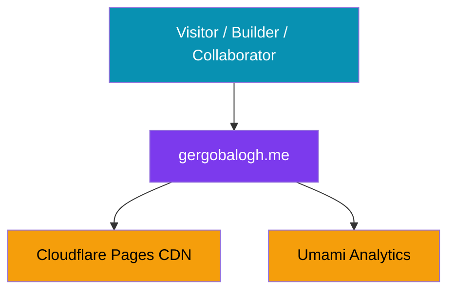
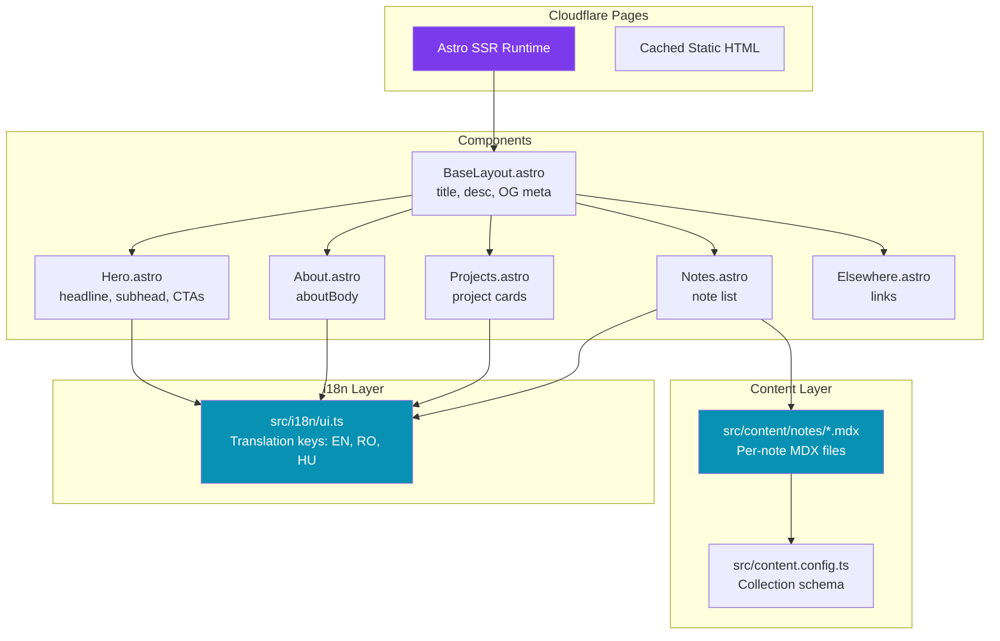

# C4 Diagrams — gergobalogh.me

## System Context



## Container



## Component — i18n Subsystem

```mermaid
graph TB
    subgraph src/i18n/ui.ts
        Langs[languages const<br/>en, ro, hu]
        TransType[Lang type]
        Default[defaultLang: en]
        TransObj[translations object<br/>en{}, ro{}, hu{}]
        TransKey[TranslationKey type]
        UseTrans[useTranslations fn<br/>returns t key lookup]
        GetLang[getLangFromUrl fn<br/>extracts lang prefix]
    end

    subgraph Consumers
        BaseLayout2[BaseLayout.astro]
        TopBar2[TopBar.astro]
        Hero2[Hero.astro]
        About2[About.astro]
        Projects2[Projects.astro]
        Notes2[Notes.astro]
        Elsewhere2[Elsewhere.astro]
        ProjectPages[Project detail pages<br/>×9 files]
        NotePages[Note detail pages<br/>×6 files]
    end

    Consumers --> UseTrans
    UseTrans --> TransObj
    GetLang --> Langs

    style TransObj fill:#0891b2,color:#fff
    style UseTrans fill:#7c3aed,color:#fff
```
